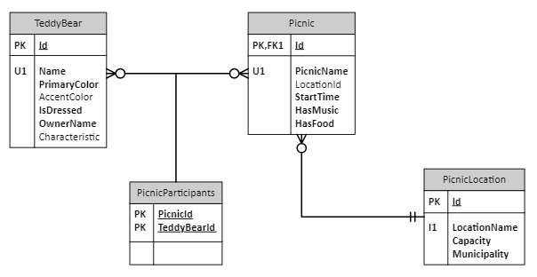

# DotNet Language Switcher Challenge

## Overview

This assignment is intended to teach a developer how to build a basic .NET API. The assignment will include 
building REST API endpoints, calling external REST APIs, database interactions, and building unit tests.

When you are finished, you will have built a 
REST-ful WebAPI app that accesses a SQL Server database and external web services and returns data back
to callers in the form of JSON.

## Learning Objectives

This challenge should build .NET proficiency in:

- REST API creation
- Calling external APIs
- CRUD Database Interactions
- Unit Testing

## Grading Criteria

If you haven't already, create a new branch, add and commit all of your changes and push to your GitHub repo. Then create a Pull Request and request a review from our SME's Brian Lee and Kenny McClive. (If you get feedback, discuss with the reviewer to understand the change and determine if it needs to be changed before continuing)

Once the SME's have approved, post in the [.Net Tech Challenge Team](https://teams.microsoft.com/l/channel/19%3azSCETTurxwEbYsw8MxRO3lOB2qJoApFAoI0IZApiYts1%40thread.tacv2/General?groupId=7f01a450-beca-4fea-b634-9acf8cb22c2d&tenantId=ae9d6e9a-cc18-4204-ac29-43a0ccb860e8) so your course can be marked as completed in the LMS system.

## Technical Setup

The exercise requires that you install [Visual Studio Code](https://code.visualstudio.com/) -
which runs on Windows, Macs and Linux machines and on the SQL Server database (natively on 
Windows, in a Docker image on Macs). It will use Swagger (aka OpenAPI) as a testing tool. 
It uses the 
[.NET Core Command Line Interface](https://learn.microsoft.com/en-us/dotnet/core/tools/) 
(aka the Dotnet CLI). Hints on using the CLI & VS Code are [HERE](./docs/0-dotnet-CLI.md)

Follow the [Getting Started Doc](/docs/0-Technical-Setup.md) to install the necessary tools and setup a local SQL Server instance.

## Tutorial

Using the button above, create a new repository  (Prefix the name of the repo with your username). Then clone your repository to your local machine. Make sure to create a new branch off `main` so you can create a PR for the final reviewers.

After setting up your repository, simply follow the steps below, starting with [Scaffolding the application and initial data access](./docs/1-ScaffoldingYourProgram.md)

The steps will reference dotnet commands, reference the [.NET CLI](/docs/0-dotnet-CLI.md) for more information

- [Scaffolding the application and initial data access](./docs/1-ScaffoldingYourProgram.md)
- REST API Construction
    - [Database Read](./docs/2-ContinueWithDataAccess.md)
    - [Database Update](/docs/3-Database-Update.md)
    - [Database Create](/docs/4-Database-Create.md)
    - [External Service](/docs/5-External-Service.md)
- [Unit Tests](/docs/6-Unit-Testing.md)

You can get help and learn from others in the [.Net Tech Challenge Team](https://teams.microsoft.com/l/channel/19%3azSCETTurxwEbYsw8MxRO3lOB2qJoApFAoI0IZApiYts1%40thread.tacv2/General?groupId=7f01a450-beca-4fea-b634-9acf8cb22c2d&tenantId=ae9d6e9a-cc18-4204-ac29-43a0ccb860e8).

### Other Programming Notes

Other documents are included that explain some key C# and .NET concepts (that differ from
other languages).  The articles emphasize topics that may be unclear to programmers
coming from other languages.  These documents include:

* [Information about the .NET Type System](./docs/Notes/0-TypeSystem.md)
* [How Code is Packaged in a .NET App](./docs/Notes/1-Packaging.md)
* [Language Integrated Query - LINQ](./docs/Notes/2-AboutLinq.md)
* [C# Properties and Indexers](./docs/Notes/3-Properties.md)
* [Tasks, Asynch and Await](./docs/Notes/4-AsyncAndAwait.md)
* [C# Attributes](./docs/Notes/5-Attributes.md)
* [IDisposable and `using`](./docs/Notes/6-UsingIDisposable.md)
* [Generics and C#](./docs/Notes/7-Generics.md)
* [Enumerated Types (`enum`)](./docs/Notes/8-EnumTypes.md)
* [Delegates and Events](./docs/Notes/9-DelegatesEvents.md)

## Teddy Bears and Picnics

The tutorial application uses a "Teddy Bears and Picnics" database.  It is a simple database
was designed to include a one-to-many relationship and a many-to-many relationship.  It contains
no useful data at all.

  
_Teddy Bears and Picnics Database Diagram_

> ---
> **Why Teddy Bears and Picnics**  
> The app needed a database and using business-focused data seemed pretty ordinary. 
> The idea of Teddy Bears and Picnics is inspired the children's song 
> [The Teddy Bear's Picnic](https://en.wikipedia.org/wiki/Teddy_Bears%27_Picnic).
> 
> That song was one of the first songs ever recorded (there was an Edison wax cylinder created in 1908).
> The [first version with words was recorded in 1932](https://www.youtube.com/watch?v=dZANKFxrcKU). 
> Since then, It's been recorded by everyone from [Bing Crosby](https://www.youtube.com/watch?v=8pgqElbAR8I) 
> to [Jerry Garcia](https://www.youtube.com/watch?v=67Mowhcj8OM) of the Grateful Dead.
> 
> If you are interested in the song as a book to read to your kids, there are 
> [many versions available](https://www.amazon.com/s?k=the+teddy+bears+picnic+book)
>
> ---