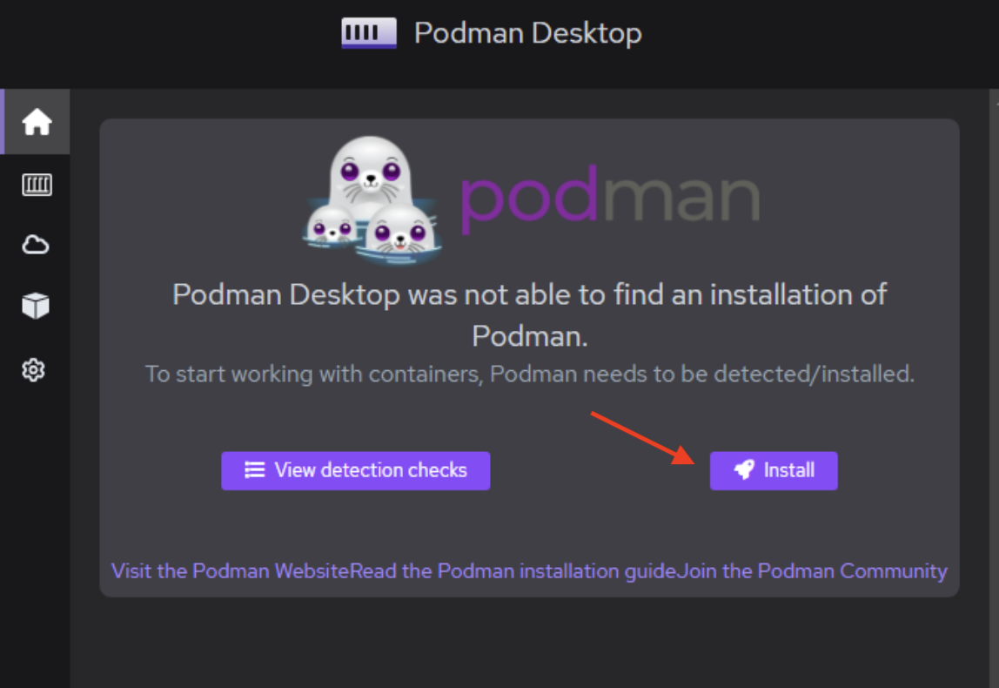
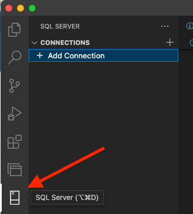
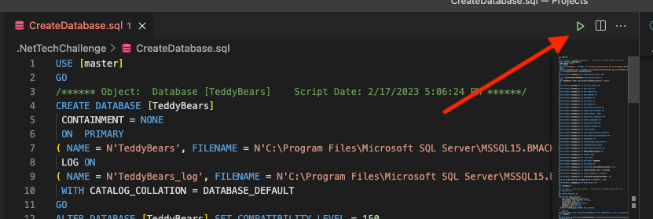
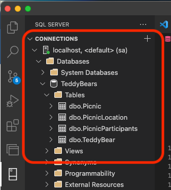

# Getting Started

## Installing an IDE and Tools

There are a number of IDEs, both paid and free, one can use to develop C#/.NET. In this tutorial, we will be
using Visual Studio code.  The code will be running in `.NET 7.0`, the latest version of `.NET Core`

### Required

Before we start, we need to install two things:

* [.NET 7.0](https://dotnet.microsoft.com/en-us/download/dotnet/7.0)
* [Visual Studio Code](https://code.visualstudio.com/)

> ---
> **Note**: If you have problems with installing .NET 7.0 on a Mac  use `brew` to do it:
> ```
> brew install dotnet-sdk
> ```
> You may also need to remove the /opt/podman directory from Podman Desktop install
> 
> ---

VS Code is a very configurable programmer environment.  Features are added by installing _extensions_. To install an extension in VS Code, click the _Settings_ icon (an gear icon in
the bottom left of the screen) and choose _Extensions_ from the menu that pops up.  Seach for 
the Extension to install in the _Search Extensions in Marketplace_ textbox at the top of the
Extensions pane.

The following extension(s) are required:
* [C#](https://marketplace.visualstudio.com/items?itemName=ms-dotnettools.csharp)
* [SQL Server (mssql)](https://marketplace.visualstudio.com/items?itemName=ms-mssql.mssql) - required for Mac users, useful for Windows users

Other useful VS Code extensions for this tutorial include:
- .NET Core Tools
- Test Explorer for .NET Core (MSTest, xUnit, NUnit)
- NuGet Package Manager
- Visual Studio IntelliCode 
- IntelliCode
- GitLens
- Markdown All in One
- Code Spell Checker

> ---
> **Note**: _Make Sure VS Code is Up to Date_  
> In VS Code, click the Gear icon (/Settings) in the lower left corner of the screen to 
> see if you need to install any updates (the last menu entry).  Install updates if needed.
>
> ---

## Installing SQL Server and Setting up the Database

This tutorial uses SQL Server as its datastore.  Follow the instructions below to set things up

* [Setting up the Database for Macs](#database-setup-for-macs)
* [Setting up the Database for Windows Machines](#database-setup-for-windows)

### Database setup for Macs

The database will be installed via a Docker image:

* Setting up the SQL Docker image
  - [Install Podman Desktop](https://podman-desktop.io/) (Free version of Docker)
  - Open Podman Desktop
  - Click "Install" on Podman Desktop Dashboard to install the podman engine 
  
  - Open a terminal/command prompt and execute the following to start a podman instance
      ```shell
      podman machine init
      podman machine start
      ```
  - Pull and run sql server
      ```shell
      podman pull mcr.microsoft.com/azure-sql-edge:latest
      podman run --name SQLServer -e 'ACCEPT_EULA=1' -e 'MSSQL_SA_PASSWORD=.netChallenge' -p 1433:1433 -d mcr.microsoft.com/azure-sql-edge:latest
      ```

- Connect to the Local Sql Server

    > ---
    > Some users found Azure Data Studio to be a better experience than the SQL Server VS code extension. That tool can be used and installed from [here](https://learn.microsoft.com/en-us/sql/azure-data-studio/download-azure-data-studio?view=sql-server-ver16&culture=en-us&country=us&tabs=redhat-install%2Credhat-uninstall)
    >
    > ---
  
    - Open the SQL Server Extension tab in VS Code  
        
    - Click `Add Connection`
    - Paste this connection string into the VS Code Command Palette (After closing VS Code you may need to re-create this connection):  
      `Server=localhost; User Id=sa; Password=.netChallenge;` 
    - Optionally Name the connection
    - Click `Enable Trust Server Certificate` on dialog popup
  
        > ---
        > **Note**: You will be using the connection string shown above (`Server=localhost; etc`)
        > during this tutorial.  We've used a reduced version of the connection string above.
        > We'll be using the one below going forward.  Copy and paste it somewhere useful:  
        > `Server=localhost; User Id=sa; Password=.netChallenge; TrustServerCertificate=true; Database=TeddyBears`
        >
        > ---

- Initialize the Database
    - Open the `CreateDatabase.sql` script and click the green play button to execute on local 
      DB.
        - The script starts with `Create Database` and runs right through to create all tables,
           indexes, constraints, etc. that are needed  
          
    - Verify the script ran by opening the VS Code SQL Server Extension View and navigating
       to   
      `Databases -> TeddyBears -> Tables`      
        

### Database setup for Windows

* Getting Ready:

  * If you don't already have a version of SQL Server installed on your machine, install one 
    of the free editions of 
    [SQL Server](https://www.microsoft.com/en-us/sql-server/sql-server-downloads), either the
    Developer edition or the Express edition
  * If you don't already have 
    [SQL Server Management Studio](https://learn.microsoft.com/en-us/sql/ssms/download-sql-server-management-studio-ssms?view=sql-server-ver16) (aka SSMS) installed,
    Install it.
  * Open SSMS and set the `Server Name` (in the pull down) to point to your local version of
    SQL Server.  In all likelihood, this will be named `[MachineName]\[UserName]`.  For example
    `SL-123456123456\FLASTNAME`
      * Remember that server name string - you will need it later

* Running the SQL Script
  * From within SSMS, from the `File` menu, choose `Open` and then `File` and open the 
    `CreateDatabase.sql` file.
  * Press the `Execute` button (with a green triangle "play" icon) on the toolbar to run the 
    script
    * The script starts with `Create Database` and runs right through to create all tables,
      indexes, constraints, etc. that are needed
  * Right-click on the server name in the `Object Explorer` pane and choose `Refresh`
  * Open the `Databases` folder and there should be an entry for `TeddyBears`
    * Under TeddyBears, open `Tables` and you should see the four tables that were created
  
---
>**Note**: You will need to use a connection string to the database in several places in 
>the upcoming tutorial.  Assuming that the `ServerName` looks like `SL-123456123456\FLASTNAME`,
>The connection string will look like:  
>  
>`"Data Source=SL-123456123456\FLASTNAME;Initial Catalog=TeddyBears;Integrated Security=True"`   
> 
>Remember, if you use that string in a C# string or in a JSON string, you will need to 
>escape the backslash (by doubling it)
---
