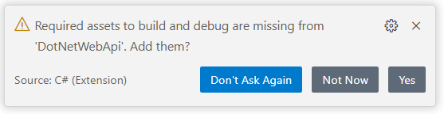
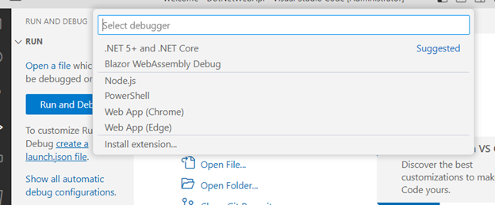
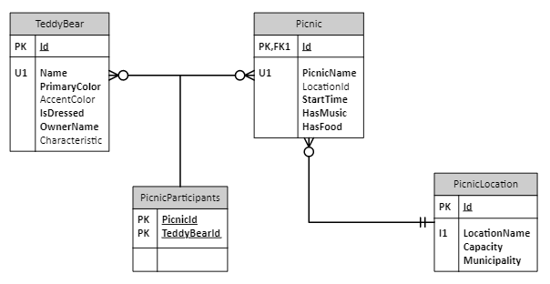

## Starting from scratch

1. In an appropriate folder/directory, create a new folder named `DotNetWebApi`
   
2. In a console window change to that folder and run the following:  

    ```
   dotnet new webapi -lang C# -n DotNetWebApi -f net7.0 --use-program-main
    ```
   _This will create a folder (also named DotNetWebApi) containing a scaffolded C# WebAPI
   project using .NET 7, using the old-style `Program.Main` code (rather than 
   [top level statements](https://learn.microsoft.com/en-us/dotnet/csharp/whats-new/csharp-9#top-level-statements))_

3. Open VS Code

    > ---
    > **Note**: if you want to work in Visual Studio (on Windows), see the notes
      [below](#integrating-with-visual-studio)
    >
    > ---
   
4. Within VS Code, choose to _Open a Folder_, opening the newly created
   `DotNetWebApi\DotNetWebApi` folder.  
   _You should see Program.cs, appSettings.json and several other files_.

5. Once you open the folder, you should see a popup in the lower right corner of the screen
   like the following.
     
   Choose `Yes`.  This will add a `.vscode` folder with `launch.json`
   and `tasks.json` files.  

   > ---
   > **Note**: 
   > If you don't act when the "Required assets to build and debug" dialog pops up, you 
   > will eventually need to add the debug configuration manually.  To do that:
   > * From the `Run` menu, choose `Add Configuration` - a dialog similar to the one below
   >   will appear
   > * Choose `.NET 5+ and .NET Core` from the displayed list - this will ad the `.vscode` 
   >   folder with the required `launch.json` and `tasks.json` files.
   >
   > ---

6. On the left side of the VS Code window, there's a triangle icon with a small bug on it.
   That's the "Debug" button.

7. If you press that button, a `[Run and Debug]` dropdown appears at the top-left with a green
   arrow next to it.  Press that button, and your program will build and then launch.  Note
   that a debug toolbar will pop up with `[Pause]`, `[Step Over]`, `[Step Into]`, `[Step Out Of]`,
   `[Restart]` and `[Stop]` icons/buttons on it.  Also note that there are hotkeys associated
   with each action (and that `[F5]` is associated with `[Start Debugging]`). You might  see a popup like the one below.  If so, choose `[.NET 5+ and .NET Core]`:  
     

8. When you started debugging, a browser window/tab should have popped up with a 404 (Not
   Found).  You can fix the 404 by appending `/swagger` to the URL.

9.  Once the Swagger documentation is shown, press the `GET` button next to _Weather      
   Forecast_, then _Try it out_, etc.  You should see some JSON returned with a mocked 
   weather forecast.

10. To get the Swagger page to pop up automatically when you start debugging, do the
    following:
     * Open the `.vscode\launch.json` file.
     * Find the `serverReadyAction` property in the main `configurations` object.
     * Change it so that it looks like _(i.e., by adding the final line)_:

    ```JSON
    "serverReadyAction": {
        "action": "openExternally",
        "pattern": "\\bNow listening on:\\s+(https?://\\S+)",
        "uriFormat": "%s/swagger"
    },
    ```

> ---
> **Note**: Notice that file and folder names generally use PascalCasing.  See 
  below for [information on naming](#net-naming---namespaces-types-members-and-variables) 
  in C# and .NET
>
> ---

### Looking at your Initial Code

The `Main` method can be found in `Program.cs`.  If the scaffolding command you ran did not
include the `--use-program-main` option, then this code would have appeared outside of a
class and outside of a method (i.e., just the statements, not class and method wrappers)  

C# (since C# 9) has supported 
[Top Level Statements](https://learn.microsoft.com/en-us/dotnet/csharp/whats-new/csharp-9#top-level-statements). If you have a single C# source file in your application that
only contains a set of C# statements, then that code is assumed to be the contents of your
`Main` method.

The `Main` code:

* Creates a `Builder` object, 
* Configures the Builder, 
* Uses the Builder to create an `App` object,
* Configures the App, and
* Lets it run.

This pattern and the associated [Options Pattern](https://learn.microsoft.com/en-us/dotnet/core/extensions/options) (not used here) are the typical way to bootstrap all but the most
trivial of .NET Core apps.

In particular, the line in the `Main` program that says:

```C#
    builder.Services.AddControllers();
```

Reflects over all of the types in your application, finding those that implement
`ControllerBase`.  In this case, the only class like that is `class 
WeatherForecastController` in the `Controllers\WeatherForecastController.cs` source file.  
When the program starts up, it will wait for a WebAPI call to that controller.

## Adding in Database Access

Starting in the folder you created above to hold your code (`DotNetWebApi\DotNetWebApi`), do 
the following:

1. Before you start, you need to add two `NuGet` packages. _NuGet_ is the standard .NET
   package manager.  It is pronounced like the English word _nougat_:

   ```shell
   dotnet add package Microsoft.EntityFrameworkCore.Design
   dotnet add package Microsoft.EntityFrameworkCore.SqlServer
   ```

2. Create a new folder named `Models` (i.e., `DotNetWebApi\DotNetWebApi\Models`)

3. Run the following from a command console to install the _Entity Framework_ 
   extensions to the `dotnet` tool:

   ```shell
   dotnet tool install --global dotnet-ef
   ```

4. From a command console, in the `DotNetWebApi\DotNetWebApi` folder, run the 
   following command (all one line):

    ```shell
    dotnet ef dbcontext scaffold "connectionString" Microsoft.EntityFrameworkCore.SqlServer --data-annotations --context-dir Models --output-dir Models
    ```

    **Notes**: 
   * The `"connectionString"` in the command shown above is the connection string you used
     when setting up the database initially. **Make sure you update the connection string**
     in the command above.
   * If you get TLS/SSL or security issues, add the following to your connection string: 
     `;TrustServerCertificate=false;Encrypt=False`.
   * If need to run this a second time, the system will complain that _The following file(s)
     already exist in directory_.  In this case, you'll need to add the `--force` option the end of the `dotnet ef dbcontext scaffold` command.

5. To get this working, we need to wire our database context into the running application.
   This is a two-step process:

    * Open `Program.cs` in VS Code, right before the call to `builder.Build();` add the
      following line of code

        ```C#
        builder.Services.AddDbContext<TeddyBearsContext>(
            options => options.UseSqlServer(
                builder.Configuration.GetConnectionString("TeddyBearsDB")));
        ```
      * In that line, the `AddDbContext` method takes a 
        [_Delegate_](./Notes/9-DelegatesEvents.md) representing a function
        that `AddDbContext` should run. A delegate is a type-safe function pointer.
        The delegate is expressed as a 
        [_Lambda_ expression](./Notes/9-DelegatesEvents.md#anonymous-methods-and-lambdas).
    * Open the `appsetting.Development.json` file, add a `ConnectionStrings` property after 
      the `Logging` property.  Use the connection string you used when setting up the 
      database in the [previous exercise](./0-Technical-Setup.md) (if the connection 
      string contains a backslash (`\`), remember that it needs escaping in JSON, by
      doubling it up):

        ```JSON
            "ConnectionStrings": {
                "TeddyBearsDB":  "connectionStringGoesHere"
            }
        ```

   > ---
   > **Note**: About missing definitions for `TeddyBearsContext` & `UseSqlServer`
   >
   > ---
   >
   > You may get red squiggly lines under `TeddyBearsContext` and `UseSqlServer` when
   > you add the call to `builder.Services.AddDbContext`. If you click on either of those
   > words, a yellow light bulb icon should show up.  Clicking on that will reveal a 
   > `Quick Fix` that will insert a `using` statement at the top of your code.  If you 
   > do that for both items, you will eventually end up with this code beginning your
   > `Program.cs` file:
   > ```C#
   > using DotNetWebApi.Models;
   > using Microsoft.EntityFrameworkCore;
   > ```
   > ---

### Examining the Database Access Code

When this is complete there will be four new C# files in the `Models` folder:

* TeddyBearsContext.cs
* Picnic.cs
* PicnicLocation.cs
* TeddyBear.cs

The `TeddyBearsContext.cs` file is the _database context_ file that defines the 
`TeddyBearsContext` DbContext class.  It manages the relationship between the database tables
and the Entity Framework model classes that describe them.

  
_The Teddy Bears Database Data Model_

In the diagram above, you can see that a single `PicnicLocation` can be used to host multiple
`Picnics`.  Each `Picnic` has many `TeddyBears` and a single `TeddyBear` can attend more
than one `Picnic`

The other three files match three of the four database tables that were setup earlier.  The
fourth table (`PicnicParticipants`) describes a _many-to-many_ relationship between the
`Picnic` table and the `TeddyBear` table.  This many-to-many relationship is defined in code
in this system (in the `TeddyBearsContext.cs` file).  In particular, this relationship is 
defined in the code (in `TeddyBearsContext.OnModelCreating`) that starts at about line 47 of
`Models\TeddyBearsContext.cs`:

```C#
[Line 47]    entity.HasMany(d => d.TeddyBears).WithMany(p => p.Picnics)
```

The C# classes that define the table models include data annotations (using standard C#
[_Attributes_](./Notes/5-Attributes.md)) 
like `[Table("TeddyBear")]` and `[StringLength(50)]` because we included
`--data-annotations` in the `dotnet ef dbcontext scaffold` command.  The default behavior is
to define this in code in the database context class.

Also note that relationships between tables show up as [properties](./Notes/3-Properties.md)
in each of the two tables.  For example, consider the Picnic <-> Location relationship; a 
single location can host many Picnics.  This is realized in the `Picnic` class as:

```C#
[ForeignKey("LocationId")]
[InverseProperty("Picnics")]
public virtual PicnicLocation? Location { get; set; }
```

and in the `PicnicLocation` table as:

```C#
[InverseProperty("Location")]
public virtual ICollection<Picnic> Picnics { get; } = new List<Picnic>();
```

Your code can traverse from either class to the other.

These classes (`Picnic`, `PicnicLocation` and `TeddyBear`) are sometimes known as [POCO
objects](https://en.wikipedia.org/wiki/Plain_old_CLR_object), or _"Plain Old CLR Objects"_.
They are classes that consist entirely of properties.  A similar concept exists in the 
Java world (POJO objects).

The database we created previously included comments/descriptions as SQL extended properties 
for each table and for each column.  These show up as _XML Comments_ in the model classes and 
`HasComment` calls in the `OnModelCreating` method of the database context class.  The XML
comments are particularly useful, providing tooltips for the Table classes and the Column
properties as you are working in the code.

Once you get the controller working (see below), look at the output for a single picnic 
from the `Picnics` endpoint:

```JSON
{
   "id": 1,
   "picnicName": "Picnic At Oakwood",
   "locationId": 1,
   "startTime": "2023-03-04T14:00:00",
   "hasMusic": true,
   "hasFood": true,
   "location": null,
   "teddyBears": []
}
```

The `location` is `null` and the `teddyBears` invitation list is shown as empty.  This is 
because the controller is fetching `_context.Picnics` from the database.  By default, the
database access mechanisms do not reach across relationships to include information from
other tables.

We could tell the system to `Include` other tables during the fetch, and cross-table
information would be returned.  However, remember that each table in a relationship has a
property that allows traversal to the other table. This can result in an exception to prevent
cycles in the data access.

### Testing the Database Access Code

To test the code, we will make a new controller (`PicnicController`) with a simple `GET`
method, then run the program and see that it works.

1. In _VS Code_, right-click the `Controllers` folder and choose `New File`.  Name the file
   `PicnicController.cs`

2. Add the following code to that file:

    ```C#
    using Microsoft.AspNetCore.Mvc;
    using Microsoft.EntityFrameworkCore;
    using DotNetWebApi.Models;

    namespace DotNetWebApi.Controllers;

    [Route("api/")]
    [ApiController]
    public class PicnicController : ControllerBase
    {
        private readonly TeddyBearsContext _context;

        public PicnicController(TeddyBearsContext context)
        {
            _context = context;
        }

        [HttpGet("Picnics")]
        public async Task<ActionResult<IEnumerable<Picnic>>> GetPicnics()
        {
            var picnics = await _context.Picnics.ToListAsync();
            return picnics;
        }
    }
    ```

3. In _VS Code_ press `[F5]` to start debugging.  In the Swagger page that shows up, notice 
   that there is now an entry for the `Picnic` controller, with a `GET` method at the
   `api/Picnics` endpoint.  Choose to _Try it out_.  A list of Picnics from the database
   should show up.

### Looking at the Controller Code

In the `PicnicController` class, the constructor follows the typical 
[_Dependency Injection_](https://learn.microsoft.com/en-us/aspnet/core/fundamentals/dependency-injection)
pattern, receiving an injected database context reference from the DI Container (configured in 
that call to `builder.Services.AddDbContext<TeddyBearsContext>()` in Program.cs).

The actual endpoint is implemented in the `GetPicnics` method.  It's a standard C# 
asynchronous call using [the `async` and `await` keywords](./Notes/4-AsyncAndAwait.md) and 
returning a generic `System.Threading.Tasks.Task` instance.  In effect (ignoring the 
asynchrony), it returns a collection of `Picnic` objects, a collection that gets fetched 
from the database asynchronously during the _awaited_ call to `ToListAsync`.

Put a VS Code breakpoint on the `return` statement in `GetPicnics` (i.e., on 
`return picnics;`) and run the program again, executing the `GET` method on the 
`api/Picnics` endpoint in Swagger.  The `GET` method will not return, instead the program
will break at that statement within VS Code.

Look in the blue text that shows up in the _Debug Console_ tab of VS Code while the program
is stopped at the breakpoint:

```sql
SELECT 
    [p].[Id], 
    [p].[HasFood], 
    [p].[HasMusic], 
    [p].[LocationId], 
    [p].[PicnicName], 
    [p].[StartTime]
FROM [Picnic] AS [p]
```

Under the covers, the Entity Framework has translated `_context.Picnics` to that SQL code.
When the expression is enumerated 
(or [_realized_](./Notes/2-AboutLinq.md#moving-to-database-access---iqueryablet)) 
(in the call to `ToListAsync`), that SQL
is transmitted to the database, executed and the resultset returned to the program.  When
the `await` completes, the results end up as a `List<Picnic>` (all lists implement
`IEnumerable`) and is assigned to the `picnics` variable.  That list is used to construct an
`ActionResult` and the JSON that is generated by that construction is returned from the
endpoint.

## .NET Naming - Namespaces, Types, Members and Variables

The .NET Framework and .NET Core has always had very specific naming rules.  The rules for
naming _fields_ (aka member variables) changed slightly about 10 years ago with the advent of
.NET Core, but otherwise it's been very consistent.

In particular, .NET names never have embedded underscores or hyphens, and are never entirely
in upper case (no snake_case, kebab-case, or SCREAMING names).

* **Solutions and Projects**  
  Solutions and projects names are always `PascalCase`.  Since solution files (\*.sln) and
  project files (*.*proj) are generally in folders of the same name, folder (aka directory) names are also traditionally PascalCase

* **Namespace and Type Names**  
  Namespaces and types (whether `class`, `struct`, `delegate`, `event` or any
  other type name) are always `PascalCase`.  Interfaces are special, so...

* **Interfaces**  
  Interface names are special.  Traditionally, they start with the letter `I` (capitalized).
  Otherwise they follow PascalCasing rules.  Examples include these framework provided 
  interfaces: `IComponent` and `IPersistable`.  Using 
  [Hungarian variable naming](https://en.wikipedia.org/wiki/Hungarian_notation) may seem a 
  little antiquated, but the convention was adopted back in the days of Microsoft's COM 
  (the Component Object Model), and has continued going forward.

* **Properties**  
  Property names are always `PascalCase`

* **Fields** (aka member variables)  
  Private or protected fields names are `_camelCase` with a leading underscore.  This was the
  one change that was made as .NET Core was introduced.  Before that, they were simply 
  `camelCase`.  If you have the urge to make a public field, consider exposing it as a property instead.

* **Other Class Members** (methods, delegates, events...)   
  They are also `PascalCase`

* **Method Parameters and Local Variables**   
  These should be `camelCase`

[Here's](https://learn.microsoft.com/en-us/dotnet/standard/design-guidelines/names-of-classes-structs-and-interfaces)
some more information on standard .NET naming conventions.

## Integrating with Visual Studio

> ---
> **Visual Studio??**: What happened to VS Code?
>
> ---
> This exercise was created with Visual Studio Code as the preferred development tool.
> But, it can also be done with Visual Studio as well; some folks just like Visual Studio.
> Both development tools use the same project and solution files, they both use the same
> compilers and other tools.  In fact, developers on the same project using different 
> tool sets can cooperate, with _commits_ from VS and VS Code being used interchangeably.
>
> ---

There are two ways to do this work with Visual Studio.  One is to follow the instructions
above and then add a Visual Studio _Solution_ that references the project that you have 
set up.  The other is to start fresh in Visual Studio.  The former is likely the better 
choice, particularly if you have teammates who do not work in Visual Studio:

1. Follow the instructions above and get everything working with VS Code.
   
2. Open a fresh instance of Visual Studio.  When initially asked what you want to do to
   _Get Started_, choose the _Continue without code_ choice in the lower right side of
   that popup.

3. In the main Visual Studio UI, choose `File`::`New`::`Project`.
   
4. Click in the _Search for templates_ text box (upper right) and type `Blank Solution`.
   Choose the `Blank Solution` template.
   
5. Name the solution (choose the same name we've been using: `DotNetWebApi`) and save it
   in the top-level folder we've been using (i.e., in `DotNetWebApi`, not
   `DotNetWebApi\DotNetWebApi`).  The new solution shows up in the _Solution Explorer_.

6. Right-click the new solution in the _Solution Explorer_ and choose 
   `Add`::`Existing Project` and choose the `DotNetWebApi.csproj` file that VS Code 
   created and that we've been working with.  You now have our existing project all
   set within Visual Studio and can take advantage of all Visual Studio offers.

7. Save the solution file (`DotNetWebApi.sln`).  It can be included in source control.

### Starting from Scratch in Visual Studio

Surprisingly, Visual Studio 2022 does not have the ability to scaffold up a EF Core interface
in a project.  You can start with VS 2022, but when you get to adding the database access
via Entity Framework, you will need to use the `dotnet ef dbcontext scaffold` method
described in the [Adding Database Access](#adding-in-database-access) section above.
In particular, you need to add in the two NuGet packages using `dotnet add package`, not using
the VS NuGet manager.

1. Open Visual Studio.

3. Choose `Create a New Project`.
   
4. Search for the `ASP.NET Core Web API` template.
   
5. Choose a project name and location.
   
6. Choose to use .NET 7, and accept the rest of defaults (no authentication, configure
   for HTTPS, Use controllers and enable OpenAPI) _(Note that OpenAPI is roughly a 
   synonym for Swagger)_.

At that point, you have the same basic Weather Forecast demo app that we got in the first
steps above.  You can press `[F5]` to test it.

Now go back to the [Adding Database Access](#adding-in-database-access) section above,
add in the two NuGet packages (using `dotnet add package`) and run the 
`dotnet ef dbcontext scaffold` command as described.

## Next Steps

[Continue with Data Access](./2-ContinueWithDataAccess.md)
