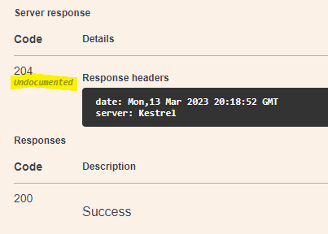

# Database Update API

This exercise works with PicnicLocations, so we'll use a new controller, the 
`LocationController`.

Create a new file in the `Controllers` folder named `LocationController.cs`.  Put this
code in as the shell of the controller:

```C#
using Microsoft.AspNetCore.Mvc;
using Microsoft.EntityFrameworkCore;
using DotNetWebApi.Models;

namespace DotNetWebApi.Controllers;

[Route("api/")]
[ApiController]
public class LocationController : ControllerBase
{
    private readonly TeddyBearsContext _context;

    public LocationController(TeddyBearsContext context)
    {
        _context = context;
    }
}
```

> ---
> **Note**: _You Can Scaffold a Controller Using the `dotnet` command_  
> It's possible to scaffold a controller using the standard `dotnet` command set.
> Take a look at 
> [Scaffold a Controller](https://learn.microsoft.com/en-us/aspnet/core/tutorials/first-web-api?view=aspnetcore-7.0&tabs=visual-studio-code#scaffold-a-controller)
>
> ---

Add the following to the newly created `LocationController`

```csharp
[HttpPut("Locations/{Id}")]
public async Task<ActionResult<PicnicLocation>> UpdatePicnicLocation(int Id, PicnicLocation location)
{
    if (Id != location.Id)
    {
        return BadRequest("URL Id must match the object Id");
    }

    var locationToUpdate = await _context.PicnicLocations.FindAsync(Id);
    if (locationToUpdate == null)
    {
        return NotFound();
    }

    locationToUpdate.LocationName = location.LocationName;
    locationToUpdate.Capacity = location.Capacity;
    locationToUpdate.Municipality = location.Municipality;

    await _context.SaveChangesAsync();

    return NoContent();
}
```

Now that we have the code lets dive deeper into a few things, first what's happening:

1. Because the `{Id}` in the route parameter to the `[HttpPut]` attribute on the method matches
   the `Id` parameter of the method, the .NET MVC/WebApi infrastructure maps the the two 
   together, picking out the Id parameter from the URL.  In addition, since the endpoint is a 
   `PUT`, the framework expects a JSON payload, and it maps that to the 
   `PicnicLocation location` parameter of the method.

2. The code makes sure that `Id` in the parameter list matches the `location.Id` passed in as
   part of the `PicnicLocation`.  There can be variations on this theme depending on the 
   standards adopted by the project.  Other possible alternatives include:
   * Don't include an `Id` parameter, just use the Id in the `PicnicLocation` entity in the body
   * Use a Picnic Location DTO (data transfer object) that doesn't include an ID
   * Force the updated location payload to use the passed-in `Id` parameter
  
3. The code fetches the PicnicLocation to update.  This causes a round trip to the server when
   the `FindAsync` call is made

4. The location record's data is updated 

5. The call to `_context.SaveChangesAsync()` is made.  This forces a second round-trip to the
   database.  However, the Entity Framework change-tracking mechanism takes advantage of this
   knowledge and only updates data that has changed.

### Try this out

Press `F5` or choose `Run` -> `Start Debugging` from the menu.  Put breakpoints at:
* The line that checks if the `locationToUpdate` is `null`
* The final `return NoContent();` line

In the Swagger page that pops up, set the `Id` to `1`, and set the `Request Body` to:

```JSON
{
  "id": 1,
  "locationName": "Big Wood",
  "capacity": 88,
  "municipality": "Oakwood"
}
```

> ---
> **Note**: The Swagger page now has both `Picnic` and `Location` entries corresponding
> to the Picnic and Location controllers
>
> ---

Note that the IDs match, and that `locationName` and `municipality` match what is already in
the database (you can see this by using other endpoints).  The only change is to `capacity`.

Before you press `Execute` on the Swagger page, go back to VS Code.  Make sure that the 
`DEBUG CONSOLE` pane is shown.  Right-click on the pane and choose `Clear Console`.

Press `Execute` on the Swagger page.  The request will not complete because the debugger
will stop on your breakpoints.  Go back to VS Code.  Note that when the debugger stops at the
first breakpoint, the Debug Console will show the SQL SELECT statement corresponding to the 
`FindAsync` call.  Press `F5` again.

Now the Debug Console shows the SQL statement for the UPDATE statement.  Look at it closely,
it only updates the Capacity column; that's the only field that's been changed.  Note that if
you re-execute the same PUT, there's no sign of any UPDATE statement in the Debug Console.
That's because the capacity has already been set; there's no need for an update.

> ---
> **Note**: REST-style dictates that PUT actions are _Idempotent_.  Doing them over and over
> again is perfectly fine, and there should be no apparent change in the result on the back
> end.  In order to achieve this, REST-style PUTs should always send all field values back to 
> the server.  If you really want to just send information to update a single field, consider 
> using an HTTP PATCH endpoint instead.
>
> ---

### Looking at the Swagger Response

If you look carefully at the Swagger response, you will see that it returns a `204-No Content`.
But, on the Swagger page, this ends up as:  



It's saying that the 204 it received was unexpected (and undocumented).  Looking at our code
above, we can see that there are three possible responses from the server:

* BadRequest (400) - if the IDs don't match
* NotFound (404) - if the requested ID can't be found
* NoContent (204) - if everything worked

We can let Swagger know that these are the expected possibilities with attributes on the call
to `UpdatePicnicLocation`.  Put the following lines immediately above the call to 
`UpdatePicnicLocation`:

```C#
[ProducesResponseType(StatusCodes.Status204NoContent)]
[ProducesResponseType(StatusCodes.Status400BadRequest)]
[ProducesResponseType(StatusCodes.Status404NotFound)]
```
Now Swagger properly documents the various return codes.

## An Alternative Approach

Let's create a second endpoint to update `PicnicLocation` entities.  In the 
`PicnicController.cs` file, add this method (ignore the terrible naming):

```C#
[HttpPut("Locations2/{Id}")]
[ProducesResponseType(StatusCodes.Status404NotFound)]
[ProducesResponseType(StatusCodes.Status204NoContent)]
[ProducesResponseType(StatusCodes.Status400BadRequest)]
public async Task<ActionResult<PicnicLocation>> UpdatePicnicLocation2(int Id, PicnicLocation location)
{
    if (Id != location.Id)
    {
        return BadRequest("URL Id must match the object Id");
    }

    var newLocationValue = new PicnicLocation
    {
        Id = Id,
        LocationName = location.LocationName,
        Capacity = location.Capacity,
        Municipality = location.Municipality
    };

    _context.PicnicLocations.Update(newLocationValue);

    await _context.SaveChangesAsync();

    return NoContent();
}
```
Instead of fetching the `PicnicLocation` entity to update as a first step, it creates
a `PicnicLocation` entity with the same ID, and tells the database context to update
the that location using this newly composed entry.

Put a breakpoint on the `return NoContent();` line of code.  You can see that there is
only one round-trip to the database; just the UPDATE SQL statement.  However, you can also
see that the change-tracking mechanism can't track the changes that were made; it doesn't
see the _before_ image of the entity to be updated.  As a result, it sets every field of
the entity in the generated update statement.  It will also do the update even if no value
changed.

Which approach to use depends on the situation.

## Next Steps

[Database Create API](/docs/4-Database-Create.md)