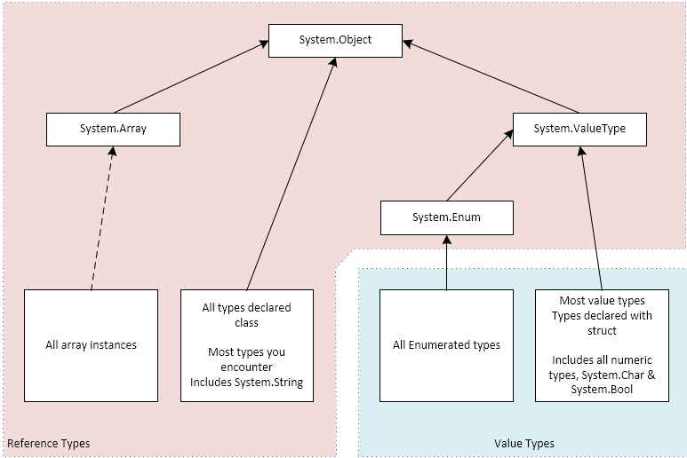

## Value Types, Reference Types & Nullability

---
**Table of Contents**  
[Looking at the illustration](#looking-at-the-illustration-above)  
[Boxing and unboxing](#boxing-and-unboxing)  
[Nullable Value Types](#nullable-value-types)  
[Nullable Reference Types](#nullable-reference-types)  
[C# Native Type Names](#c-native-type-names)  

---

The .NET and C# type system has two major kinds of _types_:

1. Value Types
2. Reference Types

In general, anything declared as a `class` is a _reference type_ and anything
declared as a `struct` is a _value type_.  Basic numeric types (like integers,
floating-point numbers and booleans are all declared as `struct` under the covers
and are value types).  Enumerated types (using the `enum` keyword) are also value
types.

The illustration below gives a rough description of the type system:



Variables of a value type contain a value.  Variables declared to be a reference
type contain references to objects resident in the _managed heap_.

The primary difference between value types and reference types is with 
_assignment_.  When you assign an integer to a variable, the value of the number
is copied to the variable.

When you assign a reference to a managed object (i.e., a reference type instance),
you fill the variable with a reference to that object (i.e., the one on the right-hand 
side of the assignment statement).  After the assignment you may have two 
variables now referencing the same object.

_**Consider this Value Type example:**_

```C#
decimal dec1 = 5.44m;
decimal dec2 = dec1;
dec1 = 3.1415m;
```
_(Note that an `m` suffix on a numeric literal makes it a `decimal` literal)_

After this code executes, the variable `dec1` contains the number `3.1415` and
`dec2` contains `5.44`.

_**Now consider this Reference Type example:**_

```C#
public class MyType {
    public int TheValue { get; set; }
    // more properties, fields, methods...
}

MyType mt1 = new MyType() {TheValue = 51};
MyType mt2 = mt1;
mt1.TheValue = 42;
```

Here, `MyType` is a class - a reference type.  The code starts by instantiating
a new instance of `MyType` and setting its `TheValue` property to `51`.  After the
first assignment, `mt1` refers to that object.

After the second assignment, `mt2` is assigned  a reference to that same object.
The third assignment changes the value of `mt1.TheValue` to `42`.  At that point, 
since `mt1` and `mt2` point to the same object, `mt2.TheValue == 42` is true.

### Looking at the illustration above

In the illustration, you can see that everything in the .NET type system inherits
from `System.Object`, whether that inheritance is explicit/declared or omitted.
Like other type systems, .NET supports single inheritance (though types may 
implement multiple `Interfaces`).

In the diagram, `System.Array`, `System.ValueType` and `System.Enum` are special.
They are `sealed` (un-subclass-able) and uninstantiable (i.e., they have no 
private constructor).  Any array you declare is automatically an instance of 
`System.Array` (and, as a result a reference type).  `System.Array` has methods
(like `Clear()`) and properties (like `Length`), so all arrays have those methods
and properties.

Similarly, `System.Enum` and `System.ValueType` have properties and methods, so 
all enums have the Enum methods/properties and all value types (including enums)
have ValueType methods and properties.

All value types are implicitly `sealed` (they can't be "subclassed").  Enums have
no constructors.  All `struct` types all get an automatic default constructor.
Programmers can add other constructors to `structs`.

### Boxing and unboxing

If a value type instance is assigned to a variable of type `object` 
(aka `System.Object`), then it becomes a boxed object:

```C#
object boxedInt = 5;
```

This often happens implicitly - it's rare that you see a boxing operation as 
explicit as is shown above.

A boxed value type can be _unboxed_ by casting it back to its original type.
If you try to cast it to any other type (including types that are implicitly
castable), then an exception will be thrown:

```C#
int five = (int)boxedInt;       //succeeds
long longFive (long)boxedInt;   //throws
```

Boxing and unboxing were way more important before the arrival of _Generics_
and _Generic Collections_.

### Nullable Value Types

The type `System.Nullable<T> where T : struct` extends nullability to structs.
It effectively adds `null` to the range of values that `T` supports; a 
`Nullable<int>` includes all of the `int`s as well as the value `null`.  It
adds two additional properties `bool HasValue` and `T Value`.  

Nullable<T> includes the semantics you expect:
1. Accessing the `Value` property of a null-valued variable will throw an
   exception.
2. The default value of all value types is zero (or zero-like); the default
   value of a `Nullable<T>` (which is a value type) is `null`.
3. It includes other subtle semantic behavior to make `Nullable<T>` behave the
   way programmers expect (but those semantics differ from the SQL language
   rules around `NULL`).

Nullable value types are particularly useful when dealing with databases where
any column can be nullable.

C# provides a shortcut name for `Nullable<T>`; they can be expressed as `T?`.
For example:

``` C#
int? ten = 10;
Debug.Assert (ten == 10);
Debug.Assert (ten.Value == 10);
Debug.Assert (ten.HasValue);

int? isANull = null;
Debug.Assert (!isANull.HasValue);
Debug.Assert (isANull == null);
// Accessing isANull.Value will throw
```

### Nullable Reference Types

Nullable reference types are a recent addition to the C# language and are very
different from Nullable Value Types (though they share syntax).

Nullable Reference types in C# are an attempt to mitigate Tony Hoare's _"Billion
Dollar Mistake"_; the null reference.  These articles describe both the _mistake_
and C#'s attempt to correct it: [Introducing Nullable Reference Types in 
C#](https://devblogs.microsoft.com/dotnet/nullable-reference-types-in-csharp/)
and 
[Nullable reference types](https://learn.microsoft.com/en-us/dotnet/csharp/nullable-references).

The idea is for programmers to be able to declare that some fields, properties
parameters and variables are nullable, and that others are not.  So, for example,
a class declared like:

```C#
class Person
{
    public string FirstName;   // Never null
    public string? MiddleName; // May be null
    public string LastName;    // Never null
}
```

Says that for any `Person` instance, the `FirstName` and `LastName` properties
will never be null and that the `MiddleName` property may be null.  As a result,
whenever a `Person` is constructed, `FirstName` and `LastName` must be
initialized.

But, the upside is that now the compiler can warn if `MiddleName` is accessed
without null-checks.  Similarly, it knows that no null-checks are needed when
either `FirstName` or `LastName` are accessed.

Reference type nullability checks are optional; they can be turned on or off at
a project or source file level.  Adding nullability to an existing code base
is tedious.  It can be rewarding - turning up previously un-noticed potential
bugs.  Adding it to new code takes a little getting used to, but generally 
results in a cleaner code base.

Sometimes a programmer knows that a variable cannot be null, but the compiler
cannot determine this.  For cases like this, the 
[Null Forgiving Operator](https://learn.microsoft.com/en-us/dotnet/csharp/language-reference/operators/null-forgiving) 
was added to the language.

It's a simple postfix exclamation mark.  When you add that to a variable, 
property, etc., it tells the compiler "Don't worry, it may look like this may be
null - it isn't".  As an example:

```C#
string? someString = null;
//some code that necessarily results in someString being non-null
var length = someString!.Length;
```

Without the `!`, the compiler would warn that `someString` should be checked for
`null` before being used.  However, you, as the programmer know that it cannot
be `null`, so you tell the compiler by using the _null forgiving operator_.

## C# Native Type Names

As described above, all types in the .NET world are either _Value Types_ or 
_Reference Types_.  There are no _intrinsic_ or _native_ types in C# or other .NET
languages like there are in other languages.

But, there are native type names.  These are also known as 
[Built-In Types](https://learn.microsoft.com/en-us/dotnet/csharp/language-reference/builtin-types/built-in-types). 
For example, the `System.String` type is known
as `string` (all lower case) in the definition of the C# language.  Stylistically,
the C# type names are preferred over the more formal .NET names.

There are several other types that get native names:

| C# Name | Full .NET Name | Value or Ref Type | Notes |
|---|---|---|---|
| `string` | System.String | Reference | the standard .NET string type
| `object` | System.Object | Reference | the root of the .NET type system
| `dynamic` | System.Object | Reference | `dynamic` is an object that can be used with late-binding
| `bool`   | System.Boolean | Value | a boolean (true/false) value
| `byte` | System.Byte | Value | an unsigned (8-bit) byte
| `sbyte` | System.SByte | Value | a signed byte
| `char` | System.Char | Value | a single (Unicode) character
| `decimal` | System.Decimal | Value | 128-bit more exact floating-point number
| `double` | System.Double | Value  | normal precision floating-point
| `float` | System.Float | Value | single precision floating-point
| `int` | System.Int32 | Value | 32-bit signed integer
| `uint` | System.UInt32 | Value | 32-bit unsigned signed integer
| `long` | System.Int64 | Value | 64-bit signed integer
| `ulong` | System.UInt64 | Value | 64-bit unsigned integer
| `short` | System.Int16 | Value | 16-bit signed integer
| `ushort` | System.UInt16 | Value | 16-bit unsigned integer
| `nint` | System.IntPtr | Value | an integer long enough to hold a pointer on this machine
| `nuint` | System.UIntPtr | Value | an unsigned integer long enough to hold a pointer

>---
> **Notes**:  
>  * The `dynamic` type matches the late-binding semantics of variables in scripting
>    languages like JavaScript.  It allows script-like behavior within C# and facilitates
>    interoperability with scripting languages and runtimes.  In general, unless you have
>    a good reason to use it, `dynamic` should be avoided.
>  * In an exception to the rule, `IntPtr` (and less commonly `UIntPtr`) are more commonly
>    used, while `nint` (and `nuint`) are rarely used in C# code.
>  * `IntPtr`s are generally used in interop scenarios (where C# code is interoperating
>    with native code (say, written in C or C++))
> ---